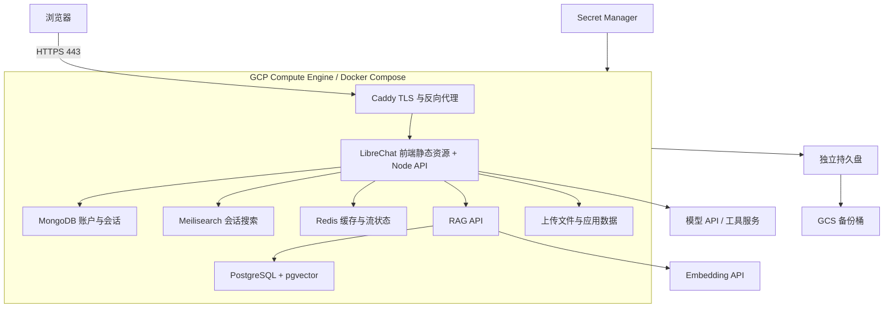

# LibreChat 自有实例：GCP 部署方案

更新：2026-09-18。状态：方案已完成，尚未部署；本文不是已验证的运行手册。

## 1. 目标与决定

使用现有 GCP 账号，服务本人和少量客户，主要访问者在中国。部署独立 LibreChat 实例，覆盖前端、后端、账户、会话、Agent、文件上传、文档检索和持久化。当前不迁移 Cited Alpha 的用户、数据库或任务。

首版采用 **Compute Engine 单 VM + Docker Compose + 独立持久盘 + GCS 备份**。同账号下优先使用独立 GCP 项目并关联既有结算账号；若复用现有项目，则必须使用独立 VM、服务账号、磁盘、备份桶及权限，不复用其他产品数据库。

区域暂选 `asia-southeast1`（新加坡）。这是候选部署地点，不是中国网络质量结论：上线前用目标客户的网络验证首页、登录、上传和长时间流式输出；香港可作为对照，但切换前还须核查所选模型服务的区域可用性。避免首版引入跨区域数据库访问。

初始容量假设：约 5–20 个账号、1–3 路同时生成、少量文档。此数值是试用目标，须压测确认，不能当作保证。

## 2. 源码与发布基线

- 官方上游：<https://github.com/danny-avila/LibreChat>
- 自有公开 fork：<https://github.com/NolanSoloBuilder/LibreChat>
- 本地目录：`/Users/xuhao/Documents/Other/LibreChat`
- 克隆时 `origin/main`：`12d78909d3f5247a8d40a47f0ef5c3ac771d9c5a`。
- 本方案审阅的 `upstream/dev`：`94fed5bcd532111161e5408bf3f86632b8ebf8db`。
- 按仓库约定，定制分支从 `dev` 创建，后续 PR 目标为自有 fork 的 `dev`。
- 查阅时最新 release 是 `v0.8.8-rc3`，GitHub 标记为 prerelease。首版以此作为候选验收版本；最终运行版本必须经下述验收后记录为具体 commit 和镜像 digest。不能因为本地检出了 `dev` 就直接部署其最新代码。

保持 `origin` 指向自有 fork，`upstream` 指向官方仓库。定制开发及上游升级均走独立分支；镜像固定 SHA/digest，禁止线上跟随 `latest` 自动更新。公开仓库仅放源码、配置模板和文档；客户资料、部署凭据、私有业务配置保存在独立受控位置。

## 3. 完整拓扑

源码依据：[Dockerfile](../../Dockerfile)、[部署示例](../../deploy-compose.yml)、[环境变量](../../.env.example)、[静态资源服务入口](../../api/server/index.js)。这里选择根目录 Dockerfile 的单应用镜像：构建 React，再由 Node 服务静态资源和 API；前后端都有，不需要额外付费托管前端。

| 组件 | 首版安排 | 数据与访问边界 |
| --- | --- | --- |
| Caddy | HTTPS、证书续期、反向代理 | 唯一公网应用入口；80 仅用于跳转/证书流程，443 提供服务 |
| LibreChat | 自有构建或验收过的固定官方镜像 | 3080 仅容器网络；自有构建同时包含前端和后端 |
| MongoDB | 自托管、启用认证 | 用户、会话、Agent 等主数据；使用独立应用账号，27017 不对公网 |
| Meilisearch | 自托管、独立 master key | 会话搜索索引；7700 仅内网；索引可重建，主库不能省略 |
| RAG API | 官方独立服务镜像，固定版本/digest | 文档处理和检索；8000 仅内网；与 LibreChat 版本联合验收 |
| PostgreSQL + pgvector | 自托管、独立账号密码 | 文档向量及相关元数据；5432 仅内网，不替代 MongoDB |
| Redis | 首版纳入、启用认证与 AOF | 6379 仅内网；配置 USE_REDIS、USE_REDIS_STREAMS 和 REDIS_URI |
| 文件数据 | 独立持久盘，映射到容器目录 | 上传原件、图片、skill、应用 data；保留文件归属和数据库引用 |
| GCS | 私有备份桶 | 保存数据库备份、文件备份和恢复清单；不开放匿名访问 |
| Secret Manager | 存放密钥 | VM 身份按需读取，运行时生成受限权限的配置文件 |
| Cloud Logging / Monitoring | 主机和服务监控 | 日志控制体积与留存；不默认记录完整提示词、文件或密钥 |

MongoDB、Meilisearch、pgvector 的源码示例版本分别为 `8.0.20`、`v1.35.1`、`0.8.0-pg15-trixie`。这是审阅基线，不代表已验证所有镜像兼容性。Caddy、Redis、RAG API 和应用镜像的最终版本/digest 在落地时写入发布清单。

首版 Redis 有助于流状态共享，但不等于任意 Agent 执行都能在进程重启后继续。需单独验证断线重连、失败收敛和重试，不能将“聊天记录还在”宣称为“任务自动恢复”。

## 4. GCP 资源配置

| 资源 | 建议起点 |
| --- | --- |
| VM | `e2-standard-2`，2 vCPU / 8 GiB，按需实例，Ubuntu 24.04 LTS |
| 启动盘 | 30 GiB，操作系统与容器运行环境；镜像/日志设清理策略 |
| 数据盘 | 100 GiB `pd-balanced`，独立挂载 `/srv/librechat`；删除 VM 时不自动删除 |
| 网络 | 独立 VPC/子网或经过审核的现有网络；区域固定外部 IP |
| 域名 | 单独子域名，具体名称待确定；解析到固定 IP |
| 运维入口 | IAP + OS Login；SSH 防火墙仅允许相应运维路径 |
| VM 身份 | 专用服务账号，限于本应用 secrets、日志及指定备份桶权限 |
| 容器镜像 | 首版可固定官方镜像；开始定制后存入自有 Artifact Registry |
| 构建 | CI 或 Cloud Build 独立构建，避免在 8 GiB 服务 VM 上构建前端 |

8 GiB 是试用起点：设置 MongoDB/搜索索引内存上限、限制同时文档摄入，并预留操作系统余量。若持续内存不足、OOM 或导入影响对话，升到 `e2-standard-4`（4 vCPU / 16 GiB），再依据监控判断是否拆分服务。GPU 不在首版范围，推理调用外部 API。

单 VM 存在单点故障和维护停机，这是试用期的可接受取舍；对客户承诺可用性前，需要另做高可用方案。首版不引入 GKE。若未来迁到 Cloud Run，应先拆出数据库和文件存储，并验证长连接与后台任务生命周期。

## 5. 数据与配置

数据盘分别保存 `mongo/`、`postgres/`、`meili/`、`redis/`、`uploads/`、`images/`、`skill/`、`data/` 和受限的运行配置。目录所有者必须匹配容器 UID，不能用全目录开放权限解决挂载问题。

配置分三类：

1. Git：Compose 定义、反向代理配置、无凭据的 `librechat.yaml` 模板和发布清单。
2. Secret Manager：数据库密码、Redis 密码、Meili key、`CREDS_KEY`、`CREDS_IV`、JWT 密钥、模型及搜索 API key。
3. 运行数据：数据库、文件、索引、任务/流状态，不进入 Git 或镜像。

`CREDS_KEY` 和 `CREDS_IV` 在产生加密凭据后必须保留并纳入恢复方案；随意重生成会影响已有凭据解密。生产 `.env` 以受限文件提供，不在命令输出或 CI 日志中打印。

`DOMAIN_CLIENT` / `DOMAIN_SERVER` 指向真实 HTTPS 域名；应用密钥在服务端配置，默认不给普通客户分发。数据库连接要与认证配置一致，不能直接沿用上游 `mongod --noauth` 和示例 PostgreSQL 密码。

账户先在受限访问状态下完成管理员初始化，再关闭公开注册（`ALLOW_REGISTRATION=false`）。确认普通用户权限后才开放客户访问。首版账号由管理员创建；若需要忘记密码、邀请邮件，再配置 SMTP 并验收邮件流程。SSO 留作企业接入阶段。

## 6. 功能范围与外部依赖

首版交付：登录、模型聊天、Agent 工具调用、上传文件、文档检索、历史会话与搜索。部署应用本身不会自动附带可用的模型或付费数据源。

- 模型 API：选择服务商、模型、密钥和请求预算；在部署区域执行真实调用验收。
- Embedding API：独立核算；固定模型与向量维度，切换模型需要重建相应索引。
- 联网搜索、抓取、OCR：按演示需要接入，核对来源权限、配额和失败处理。
- Code Interpreter / attached worker：不是普通聊天必需组件，首版默认不启用；需要时独立沙箱部署，不挂载宿主 Docker socket 或云凭据。
- Admin panel：当前上游有独立镜像，并非主 Dockerfile 自动包含的自有前端；首版可不启用。启用时单独固定镜像、配置 session secret 和 HTTPS，并限制管理员入口。
- 定时任务：首版关闭；周报需求确定后，再验证共享状态、重启、幂等和失败通知。
- 选品 Agent：后续增加独立业务工具服务，通过 MCP 接入商品库/库存/市场数据。它不属于部署 LibreChat 即自动获得的业务能力。

客户试用应使用经授权或脱敏的数据。对普通账户验证会话、文件、Agent 的隔离；多用户不应直接等同于严格企业多租户。需要强隔离的客户可以独立实例交付。

## 7. 中国用户访问与代理

首版采用域名直连 VM 的 HTTPS 入口，前后端同域，减少跨域和回调复杂度。若后续接 CDN，仅缓存有内容 hash 的静态资源；API、登录回调、文件权限接口、流式输出不能缓存。

反向代理须正确传递原始协议及客户端信息，配置受信任代理范围，并验证 SSE 不缓冲、长请求不中断、上传大小与应用限制一致。区域接近中国不保证网络稳定：至少在实际客户使用的两种网络下测试，记录首屏、首 token、上传和断线重连表现。

## 8. 备份与恢复

目标：试用期 RPO ≤ 24 小时，RTO ≤ 4 小时。均为设计目标，恢复演练通过前不能视作保障。

- 每日生成数据库逻辑备份及文件增量备份到 GCS，初始保留 14 个日备份和 4 个周备份；开启受控删除保护及生命周期清理。
- MongoDB 单节点逻辑备份与文件引用需一致：首版安排短维护窗口暂停写入，依次备份主库、向量库、文件及配置清单；不能直接拷贝正在写入的数据库目录当作有效备份。
- PostgreSQL 使用可恢复的逻辑备份；Meilisearch 备份快照或准备从主库重建；Redis 保留 AOF，但不把它当作业务主库备份。
- 升级前另做数据盘快照和应用一致备份。记录版本、digest、时间和校验结果；数据库迁移后不能只切回旧镜像就认定回滚成功。
- 私有桶使用云端加密、最小权限；读取备份和密钥的权限分开管理。备份恢复须覆盖应用加密密钥。
- 正式开放客户前，在临时环境完整恢复一次，检查登录、会话、Agent、原件下载、检索和权限隔离；记录实测恢复时间。

## 9. 发布与升级

1. 选择候选 tag/commit，核对许可证与依赖，构建固定镜像并记录源码 SHA。
2. 生成独立的部署 Compose、代理配置和配置模板；运行 `docker compose config` 校验，确认未暴露数据库端口、未使用示例凭据。
3. 创建 GCP 项目/资源、最小权限和预算告警；配置密钥、DNS、持久盘和备份任务。
4. 在限制访问的环境启动，等待数据库及应用健康检查，通过验收后开放试用。
5. 记录发布清单：应用 commit、所有镜像 digest、配置版本、数据备份点和验收结果。
6. 后续升级先在独立环境恢复备份并试升级，再安排维护窗口部署。出现问题时按数据迁移兼容性选择镜像回滚或完整数据恢复。

GitHub 到 GCP 优先使用 Workload Identity Federation，避免保存长期服务账号 JSON 密钥。构建与部署权限分离；上游同步不会自动触发正式环境更新。

## 10. 验收清单

- 两个普通账号与一个管理员账号：登录、退出、会话/文件隔离、管理员权限均正确。
- 一次真实模型调用和一次真实工具调用；失败、取消、限流及余额不足时有明确反馈。
- 上传中文 PDF，验证原件可取回、向量入库、检索结果与原文匹配；扫描 PDF 的 OCR 若未接入要明确显示限制。
- 刷新、断网重连、应用容器重启后，历史数据保持；进行中的任务状态正确收敛，避免重复工具副作用。
- VM 重启后数据盘先挂载再启动容器，数据不落到错误的空目录；数据库和缓存端口公网不可达。
- TLS 自动续期、日志轮转、磁盘水位、备份失败、容器重启和模型费用告警可观察。
- 两种目标用户网络下的实际体验通过，完整备份恢复演练通过。

本次仅修改文档，不安装依赖、不运行应用测试；以上项目留待部署阶段执行。

## 11. 费用预算

以 730 小时/月、按需 VM、30 GiB 启动盘 + 100 GiB 数据盘、小规模存储与流量估算：**首版基础设施暂按 100–180 美元/月预留**。这属于规划额度，不是已获得的 GCP 报价或账单；创建资源前须在计算器选择新加坡及实际流量复核。

| 项目 | 计费依据与控制方法 |
| --- | --- |
| Compute Engine | e2-standard-2 常驻；按实际区域单价 × 730h；暂不买长期承诺 |
| 持久盘 | 启动盘、数据盘、快照分别计费；磁盘容量不能只算已用数据 |
| 公网 IPv4 / 网络 | 地址及公网出站单独计费；面向中国的流量须按相应目的地核算 |
| GCS 备份 | 容量、版本、请求和恢复下载；按生命周期清理 |
| 构建 / 镜像 / 监控 / Secrets | 有独立计费规则；限制镜像与日志留存，不能一概按免费处理 |
| 模型 / Embedding / 搜索 / OCR | **不包含在上述基础设施额度内**；由调用量和服务商决定 |

试用期可另设模型与工具预算 30–100 美元/月作为起始配额，实际是否够用由任务长度和次数决定。预算告警不等于自动停费；要控支出，还需应用限额和供应商侧限额。升到 16 GiB 或增加托管数据库前重新估价。

价格核对入口：[VM](https://cloud.google.com/products/compute/pricing/general-purpose)、[磁盘](https://cloud.google.com/compute/disks-image-pricing)、[网络](https://cloud.google.com/vpc/network-pricing)、[GCS](https://cloud.google.com/storage/pricing)、[计算器](https://cloud.google.com/products/calculator)。

## 12. 落地前剩余输入

已确认：沿用 GCP 账号，主要供本人及少量中国客户试用。待落地时确定：具体项目与结算绑定、域名、模型/Embedding 服务商与密钥、预算上限，以及是否需要邮件和 Admin panel。

尚未执行：云资源创建、Docker 配置落地、镜像构建、真实模型调用、网络/恢复验收。先完成这些步骤，再把本文更新为实际部署记录。

官方参考：[远程 Docker 部署](https://www.librechat.ai/docs/remote/docker_linux)、[Docker 配置扩展](https://www.librechat.ai/docs/configuration/docker_override)、[Release](https://github.com/danny-avila/LibreChat/releases/tag/v0.8.8-rc3)。
